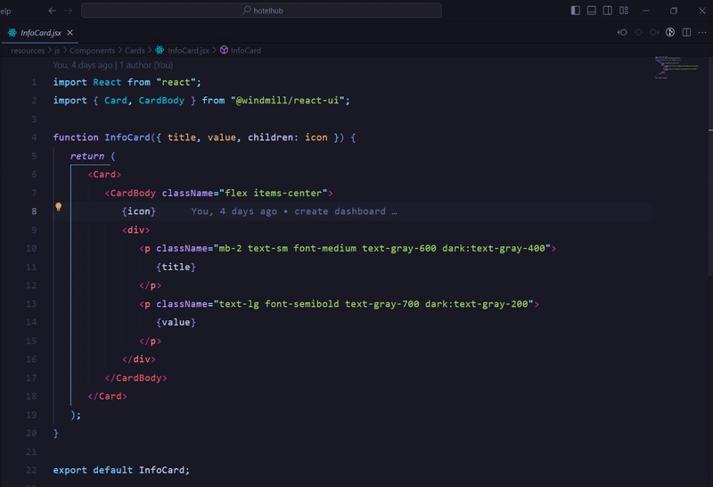

# Prefix Class VSCode Extension

This is a VSCode extension that allows you to add or remove prefixes to class names in your HTML or JSX files.

## Features

- Add a prefix to all class names in your HTML or JSX files
- Remove specific prefixes from class names
- Supports both string-based and HTML/JSX class manipulation
- Configurable settings for default prefix and supported file types
- Status bar notifications
- Works with both selected text or entire documents

## Installation

You can install this extension from the [Visual Studio Code Marketplace](https://marketplace.visualstudio.com/items?itemName=Yensubldg.prefixclass).

## Usage

### Adding Prefixes

1. Open an HTML, JSX, or TSX file in VSCode
2. Select the text that you want to modify (if no text is selected, the entire document will be processed)
3. Open the command palette (press `Ctrl+Shift+P` on Windows or `Cmd+Shift+P` on Mac)
4. Type "Prefix Class" and select one of these commands:
   - **Prefix Class: Change prefix from string** - for directly modifying class strings
   - **Prefix Class: Change prefix from html** - for modifying class attributes in HTML/JSX
5. Enter the prefix you want to add to the class names (defaults to "tw-")
6. The prefix will be added to all class names in the selected text

### Removing Prefixes

1. Open an HTML, JSX, or TSX file in VSCode
2. Select the text that you want to modify (if no text is selected, the entire document will be processed)
3. Open the command palette (press `Ctrl+Shift+P` on Windows or `Cmd+Shift+P` on Mac)
4. Type "Prefix Class" and select one of these commands:
   - **Prefix Class: Remove prefix from string** - for directly modifying class strings
   - **Prefix Class: Remove prefix from html** - for modifying class attributes in HTML/JSX
5. Enter the prefix you want to remove from the class names
6. The prefix will be removed from all matching class names in the selected text



## Extension Settings

This extension contributes the following settings:

* `prefixclass.defaultPrefix`: Default prefix to use when adding to class names (default: "tw-")
* `prefixclass.enableStatusBarInfo`: Show operation information in the status bar (default: true)
* `prefixclass.fileExtensions`: File extensions where the extension will be available (default: [".html", ".jsx", ".tsx"])

## Examples

### HTML Example

**Before:**
```html
<div class="container flex items-center">
  <span class="text-lg hover:text-blue-500"></span>
</div>
```

**After adding "tw-" prefix:**
```html
<div class="tw-container tw-flex tw-items-center">
  <span class="tw-text-lg hover:tw-text-blue-500"></span>
</div>
```

### String Example

**Before:**
```
container flex items-center
```

**After adding "tw-" prefix:**
```
tw-container tw-flex tw-items-center
```

## Contribution

If you find any issues with this extension or want to contribute, please open an issue or a pull request on the [GitHub repository](https://github.com/yensubldg/prefix-class-vscode).

## License

This extension is licensed under the [MIT License](https://opensource.org/licenses/MIT).
